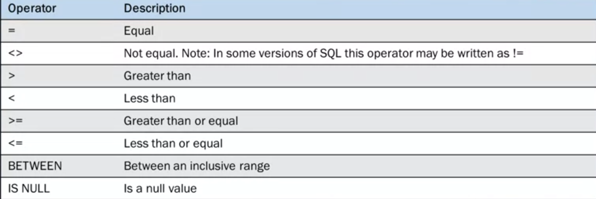

# What is SQL
Structured Query Language.  
```{r}
library(DBI)
db = dbConnect(RSQLite::SQLite(), dbname = "sql.sqlite")
```

# Creating Table

```{sql connection=db, eval = F}
CREATE TABLE shoes
(Id char(10) PRIMARY KEY,
Brand char(10) NOT NULL);
SELECT * FROM shoes
```


# Creat Temporary Tables
```{sql connectino=db, eval = F}
CREATE TEMPORARY TABLE Sandals as 
(
SELECT * 
FROM shoes
WHERE shoe_type = 'sandals'
)
```
# Commenting
- Mute few lines by `/* ....*/`.  
- Single line by `--`.  


# Filtering
Operators used to filter the data:  
```{r}
library(knitr)

```

